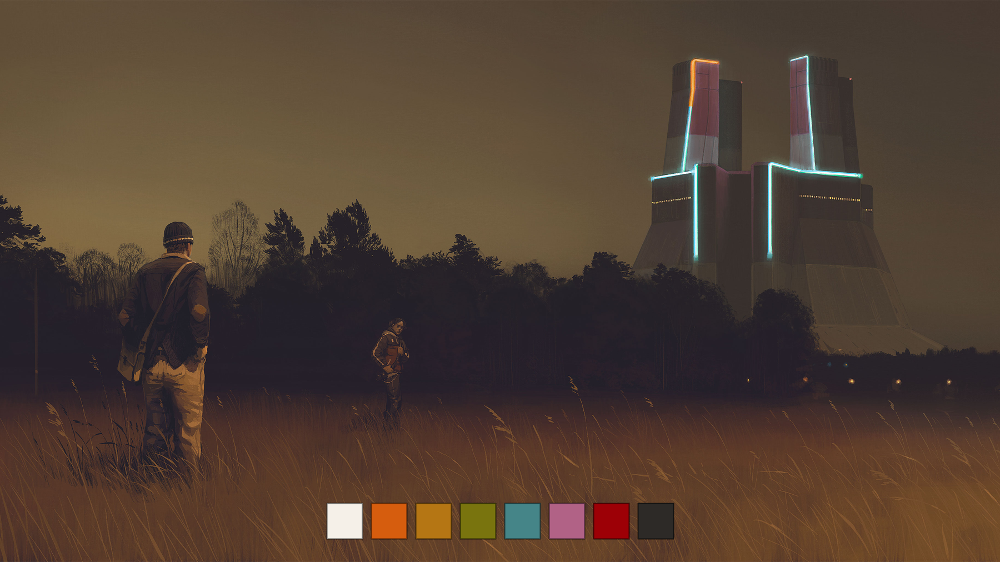

# Omarchy Cassette Futurism Light Theme

An [Omarchy](https://omarchy.org/) theme based on the Cassette Futurism palette —
**Analog Dream: Beige Terminal**: light vintage workstation colors with deep
retro accents. Dark variant: [omarchy-cassette-futurism-theme](https://github.com/taotao7/omarchy-cassette-futurism-theme).



## Install

```bash
omarchy theme install https://github.com/taotao7/omarchy-cassette-futurism-light-theme.git
~/.config/omarchy/themes/cassette-futurism-light/fcitx5/apply.sh
```

`omarchy theme install` already applies the desktop theme. Omarchy does not run scripts shipped in a theme, so the second command is what points fcitx5 at this palette: paper background, amber border, selection pill, 8px corners. It also installs a `theme-set` hook. After that, switching theme — including to the dark variant — repaints the candidate window from the active palette. Running `apply.sh` from either checkout is enough.

## Palette

| Role | Color |
|------|-------|
| Background | `#f5f0e8` |
| Foreground | `#2d2a27` |
| Accent (retro orange) | `#d65d0e` |
| Selection | `#d4c8b8` |
| Red | `#9d0006` |
| Yellow | `#b57614` |
| Green | `#79740e` |
| Cyan | `#458588` |
| Blue | `#076678` |
| Purple | `#b16286` |

The theme ships `colors.toml` plus a retro-futurism artwork background,
and hand-tuned `btop.theme` and
`helix.toml`, plus a `shell.controls.toml` section override that keeps buttons and other controls visible (stronger fills, amber accent borders). `fcitx5/apply.sh` paints the fcitx5 candidate window from the same palette. Terminal, Hyprland, shell, and editor configs are generated
from the palette by Omarchy's templates.

## Attribution

Based on the palette and theme direction from
[cassette-futurism-theme](https://github.com/taotao7/cassette-futurism-theme),
ported for Zed from [cassette-futurism](https://github.com/taotao7/cassette-futurism).

Background artwork: [wallhaven k8jk76](https://wallhaven.cc/w/k8jk76).

## License

MIT
